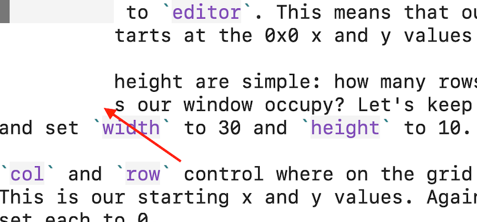
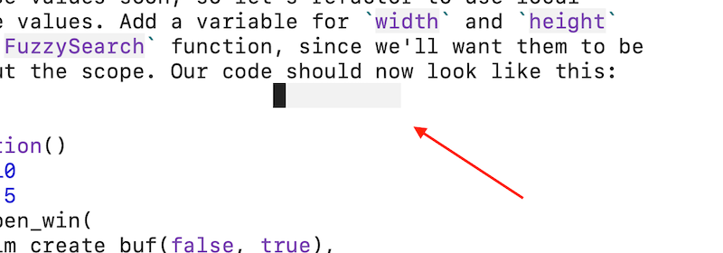
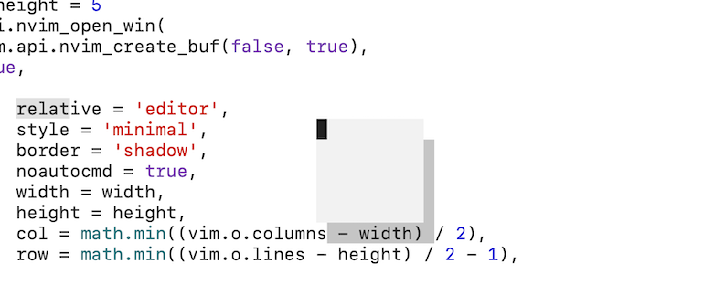
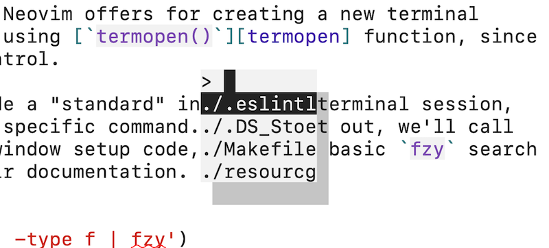
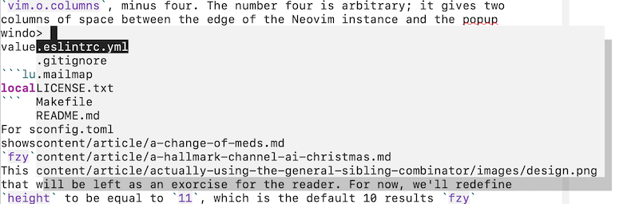

+++
title = "DIY Neovim fzy search"
date = 2022-01-12T21:34:06
draft = false
subtitle = "Learning Neovim, Lua, and fzy for fun and profit"
categories = ["Tech"]
topics = ["neovim"]
toc = true
styles = ["syntax"]
syndicated = [
    "https://old.reddit.com/r/neovim/comments/s37nrk/diy_neovim_fzy_search/",
    "https://twitter.com/chrisjohndeluca/status/1481676352008990724",
    "https://dev.to/bronzehedwick/diy-neovim-fzy-search-25lo"
]
+++

There are plenty of fuzzy search solutions for Neovim, most notably
[Telescope][telescope], but sometimes you just want something fast and simple.

<!--more-->

Enter [`fzy`][fzy], a fast command line program with a slick search algorithm.
It is a good unix citizen, operating on newline delimited lists passed through
[`stdin`][stdin], making it easy to integrate into all sorts of tools,
including editors.


During this process, I read a lot on Lua in general and Neovim specifically.

The four most helpful resources, I found, were the [Neovim Lua
Guide](https://github.com/nanotee/nvim-lua-guide), by Timothée Sterle, Heiker
Curiel's post on [configuring Neovim with
Lua](https://vonheikemen.github.io/devlog/tools/configuring-neovim-using-lua/),
the [Learn Lua in 15 minutes](https://learnxinyminutes.com/docs/lua/) guide on "Learn X in Y minutes",
and the official [Programming in Lua](https://www.lua.org/pil/) book, by
Roberto Ierusalimschy.


It's own documentation shows an example integration with Vim. However, that
implementation relies on the [`system()`][vim-system] function to display the
fuzzy finder, which [no longer works for interactive commands in
Neovim][nvim-system].

Yes, there is a [fzy plugin for neovim][fzy-lua-native], but why not take the
opportunity to learn some Neovim Lua, and write an implementation ourselves.

Along the way, we'll learn how to load and test Lua files, invoke
floating windows, handle interactive terminal inputs, create flexible
functions, and add mappings.

This guide assumes some familiarity with Vim/Neovim, as well as a basic
understanding of Lua. If you're unfamiliar with Lua, I'd recommend
reading [Learn Lua in 15 minutes][lua-15] before starting. If that
sounds fun, fire up your terminal and follow along. Otherwise, skip to
the end for [the final script](#the-final-script).

## Setup

Neovim picks up Lua files to include in the `lua` folder, so we'll create a
file there called `fuzzy-search.lua`.

```bash
mkdir -p "${XDG_CONFIG_HOME:-$HOME/.config}/nvim/lua"
nvim "${XDG_CONFIG_HOME:-$HOME/.config}/nvim/lua/fuzzy-search.lua"
```

We'll need a function for our fuzzy searching, so let's add one with a
debug value to test. We need to access this function from anywhere, so
we'll make it global by omitting the `local` keyword. By convention,
global variables in Lua start with an uppercase letter.

```lua
FuzzySearch = function()
    print('Hello, search!')
end
```

Neovim provides some handy methods for loading Lua files and functions.
We'll use [`luafile`][luafile] to load our `fuzzy-search.lua` into
Neovim's memory, and the [`lua`][luachunk] command to then call our
newly added `FuzzySearch` command while we're testing.

```vim
:luafile % " Interpret the current file as lua.
:lua FuzzySearch() " Should print 'Hello, search!' in the message area.
```

We'll need to re-run those two commands every time we make a change to
see their effects.

## Summoning the floating window

We can no longer use the `system()` hack to interact with terminal
programs inside Neovim, but we have access to something better: floating
windows! We *could* make it a split buffer, but since a search interface
is an ephemeral UI component that is fine to overlap existing content
and should be dismissed the moment a selection is made, a floating
window seems ideal.

To do this, Neovim provides the [`nvim_open_win()`][nvim_open_win] API method,
which we can access from the `vim.api` Lua table. This method takes 3
arguments:

1. `{buffer}`, for which buffer to display, by buffer ID.
2. `{enter}`, boolean for whether to enter the window or not.
3. `{config}`, a table of options.

For `{buffer}`, we ultimately want to display a new terminal buffer with the
search, so we'll need to create one here. We'll use the
[`nvim_create_buf`][nvim_create_buf] API method to create a fresh buffer, and
we'll start a terminal session inside it in a later step. `nvim_create_buf`
returns the ID of the buffer it just created, so it can be passed to
`nvim_open_win()` directly. It has 2 boolean arguments; the first for whether
the buffer will be "listed" by commands like [`:ls`][ls], and the second for if
it should be treated as a "scratch" buffer, which sets some options common to
throw-away work. Since this is a temporary window, we'll want to set this to
unlisted and scratch.

For `{enter}`, we want to start typing our search as soon as the popup
window is invoked, without having to do <kbd>C-w C-l</kbd> or whatever,
so we'll set this to `true`.

So far, our function should now look like this:

```lua
FuzzySearch = function()
    vim.api.nvim_open_win(
        vim.api.nvim_create_buf(false, true),
        true,
        {}
    )
end
```

Finally, for `{config}`, we'll be setting several options here,
largely to position the window. There are five required properties,
`relative/external`, `width`, `height`, `col`, and `row`, so let's set
them first.

Every Neovim window requires either the `relative` or `external` key
to be set. `external` is only relevant for external GUI applications,
so we'll keep it simple and only set `relative`. `relative` controls
where the window is positioned relative to, aka, where it's x/y position
originates from. Our window can be relative to the editor, the current
window, or the cursor position. This is a global search, so we'll set
`relative` to `editor`. This means that our new window's 0/0 x and y
position starts at the 0/0 x and y values of the entire editor.

Width and height are simple: how many rows, for height, and columns, for
width, does our window occupy? Let's keep this straight forward for now,
and set `width` to 10 and `height` to 5.

`col` and `row` control where on the grid the window should appear from.
This is our starting x and y values. Again, let's keep this simple and
set each to 0.

Our function should now look like this.

```lua
FuzzySearch = function()
    vim.api.nvim_open_win(
        vim.api.nvim_create_buf(false, true),
        true,
        {
            relative = 'editor',
            width = 10,
            height = 5,
            col = 0,
            row = 0,
        }
    )
end
```

Now, if you run `luafile` on your `fuzzy-search.lua` file again, and
then `lua FuzzySearch()`, our floating window should appear over the top
right of your editor!



Type `:bd` to close it.

Great, we have a floating window, but it's not going to be very helpful
looking like a postage stamp in the upper left. Let's adjust the size,
and center the window.

### Centering the window

To center the window, we'll need to calculate the mid-point for our
window's horizontal and vertical edge based on the window size and the
size of Neovim itself, with our good friend Math.

We can get the width of the editor via the [`columns`][columns] global
option, exposed in the [`vim.o`][vimo] options table, and the height via
[`lines`][lines], exposed in the same.

Let's start with the width. Our formula is pretty simple: subtract the
width of the popup from the total columns in the editor (the width),
and divide that by two to get the midway point. We need to subtract the
popup's width, since it would be pushed too far to the right without
compensating for the space it takes up. We'll finish by wrapping the
whole expression in the Lua built-in `math.min`, since `col` expects
whole numbers.

```lua
math.min((vim.o.columns - 10) / 2)
```

We'll do something almost identical for `row` (aka height), but instead of
using `vim.o.columns`, we'll use `vim.o.lines`.

```lua
math.min((vim.o.lines - 5) / 2 - 1)
```

Notice that we're also adding an extra subtraction by one. This is
because `vim.o.lines` returns the total lines in the current window,
*including* the status line and the message area. That's an extra two
lines to account for. Since we want to center the popup vertically, to
find how much to compensate by, we divide the extra lines by two, giving
us one to subtract.

Our function should now look like this.

```lua
FuzzySearch = function()
    vim.api.nvim_open_win(
        vim.api.nvim_create_buf(false, true),
        true,
        {
            relative = 'editor',
            width = 10,
            height = 5,
            col = math.min((vim.o.columns - 10) / 2),
            row = math.min((vim.o.lines - 5) / 2 - 1),
        }
    )
end
```

Looking over this code, there's some repetition causing maintenance
overhead: we're writing literals for the width and height twice. We'll
need to change these values soon, so let's refactor to use local
variables for these values. Add a variable for `width` and `height`
at the top of the `FuzzySearch` function, since we'll want them to be
available throughout the scope. Our code should now look like this:

```lua
FuzzySearch = function()
    local width = 10
    local height = 5
    vim.api.nvim_open_win(
        vim.api.nvim_create_buf(false, true),
        true,
        {
            relative = 'editor',
            width = width,
            height = height,
            col = math.min((vim.o.columns - width) / 2),
            row = math.min((vim.o.lines - height) / 2 - 1),
        }
    )
end
```

If you test this code, you'll get something like this.



Not much to look at, but at least it's centered. But why is it only one
line high, instead of five? Well, it actually is five lines high, but we
can't tell because our window has no outline style or contents. Let's
fix the former, then move on to the latter.

### Styling the window

Floating window styles are controlled by two properties, `style` and `border`. As of this writing, `style` only has one valid value: `"minimal"`. Fortunately, this option disables lots of inappropriate UI configurations for our search window, such as `number` and `spell` (see the docs for the full list).

`border` has several built in options, as well as an option to define
your own border characters (this is what Telescope does). Feel free to
play around with the options, but for the purpose of this guide we'll be
using `"shadow"`. I like this style because it's visually uncluttered,
and makes clear that this window is "above" others.

While it's not styling, let's take a moment here to set the
`noautocmd` option to `true`. This disables buffer events for the
window, since we won't be using them and it's a good practice to limit
the scope of our programs as much as sensible. Feel free to set this to
`false` later if you do end up using these methods.

Our function should now look like this.

```lua
FuzzySearch = function()
    local width = 10
    local height = 5
    vim.api.nvim_open_win(
        vim.api.nvim_create_buf(false, true),
        true,
        {
            relative = 'editor',
            style = 'minimal',
            border = 'shadow',
            noautocmd = true,
            width = width,
            height = height,
            col = math.min((vim.o.columns - width) / 2),
            row = math.min((vim.o.lines - height) / 2 - 1),
        }
    )
end
```

Test this code and you should get something like this.



Looking good. Or, at least like a stylish postage stamp. Alright, let's
move on to the contents of the window.

## Launching a fzy terminal

There are several ways Neovim offers for creating a new terminal
instance, but we'll be using the [`termopen()`][termopen] function,
since it offers the most API control.

We can ask it to provide a "standard" interactive terminal session, or
to launch running a specific command. We'll call it after our floating
window setup code, using a basic command to gather files for `fzy`
to search, taken from their documentation, that should work on most
systems.

```lua
vim.fn.termopen('find . -type f | fzy')
```

The `find` command will grab every regular file in your current
directory tree, and pass it to `fzy`. Testing this code will produce a
result similar to this.



Hooray! You should be able to search for a file, move up and down in
the list via <kbd>C-n</kbd> and <kbd>C-p</kbd>, and select a file with
<kbd>Enter</kbd>. However, you may be noticing some *slight* issues.

1. The window is too small to see the results properly.
2. Depending on your settings, you might not be in [terminal mode][terminal-mode] automatically when you enter the window, causing you to have to type <kbd>i</kbd> before you can search.
3. Selecting a file produces a `[Process exited 0]` message, making you press <kbd>Enter</kbd> again before continuing.
4. Selecting a result does not open it!

Solving the second issue is dead simple: we call
[startinsert][startinsert] before running `termopen()` via
[`nvim_command`][nvim_command].

```lua
vim.api.nvim_command('startinsert')
```

We'll address each of the other issues, but let's tackle the window size
first, so we can better see what we're doing.

### Dynamic width and height

Alright, back to window sizing. We can improve the display by taking
full advantage of the amount of space we have available to us. Since we
already re-factored our `width` and `height` to single variables, we
simply modify them where they are declared.

Wouldn't it be nice to stretch the width of the popup window to however
large the Neovim instance is? Easy. We change the `width` variable to
equal `vim.o.columns`, minus four. The number four is arbitrary; it
gives two columns of space between the edge of the Neovim instance and
the popup window, which feels right to me. Feel free to experiment with
your own values.

```lua
local width = vim.o.columns - 4
```

For setting the height, we want to show all the results that `fzy`
shows, or, in other words, we want our popup window to be as tall as the
`fzy` output. `fzy` defaults to displaying ten search results at a time.
This number can be controlled via the `--lines` option, but changing
that will be left as an exorcise for the reader. For now, we'll redefine
`height` to be equal to `11`, which is the default 10 results `fzy`
displays, plus an extra line for the search prompt.

```lua
local height = 11
```

We now have an adaptive display window that shows our searches more
clearly.



But what happens on very large screens? Our window will stretch all the
way across, packing the results at the left, and wasting space on the
right. We can spend a moment fixing this by setting a max width for the
window. The window will still center, so the eye won't have to travel
all the way to the edge to see results. The standard max line length for
Vim is a sensible 80 columns, so we'll stick to that for our window.

Since we're subtracting four from the total width, and we want to
trigger the max *after* we would naturally reach 80 columns, we'll set
the width at 85 columns.

After our local variable declarations, we'll add our conditional.

```lua
if (vim.o.columns >= 85) then
    width = 80
end
```

Now the entirety of our function should look like this.

```lua
FuzzySearch = function()
    local width = vim.o.columns - 4
    local height = 11
    if (vim.o.columns >= 85) then
        width = 80
    end
    vim.api.nvim_open_win(
        vim.api.nvim_create_buf(false, true),
        true,
        {
            relative = 'editor',
            style = 'minimal',
            border = 'shadow',
            noautocmd = true,
            width = width,
            height = height,
            col = math.min((vim.o.columns - width) / 2),
            row = math.min((vim.o.lines - height) / 2 - 1),
        }
    )
    vim.fn.termopen('find . -type f | fzy')
end
```

Let's move on to solving the third and fourth problems mentioned
above—not actually being able to open the file searched for!

### Opening the searched for file

We want to perform an action—edit a file—when the terminal process
for `fzy` exits, which happens after the file is selected. We know from
the [`fzy` man page][fzy-man] that on exit <q>the currently selected
item is printed to stdout</q>, which is how we can detect which file is
selected.

The `termopen()` function takes a table of event-driven callbacks as
it's second argument. We'll be using the appropriately named `on_exit`.

```lua
vim.fn.termopen('find . -type f', {on_exit = function()
    -- code goes here.
end})
```

Let's get rid of the extra <kbd>Enter</kbd> press. Inside the `on_exit`
callback, we'll call [`bdelete`][bdelete], meaning that once the
terminal process exits, we'll automatically delete the buffer. We'll add
the `!` option, which will delete the buffer even if there are changes
to it. This buffer should never have meaningful changes, so we never
want that safety (otherwise, if there were changes, `bdelete` would
produce an error).

```lua
vim.api.nvim_command('bdelete!')
```

If you test the function, the popup window should immediately
dismiss after a file is selected. Excellent!

Now we can move on to opening the file searched for. We know that `fzy`
prints the path to the selected file to `{stdout}`. Maybe there's an
argument that Neovim passes `{stdout}` to the terminal event callbacks?
However, the [`on_exit`][on_exit] callback only receives the [job
id][jobid], the exit code, and the event type, which in this case is
always "exit".

There *must* be a better way to solve this, but how I've figured
it out is to write the contents of `{stdout}` to a file as part
of the `fzy` pipeline, then read the file contents back in the
`on_exit` function. If you know of a better method, hit me up [on
Twitter](https://twitter.com/chrisjohndeluca).

Since the file we're creating is totally throw-away, you could say
temporary, we'll use Neovim's [`tempname()`][tempname] function to
generate a unique temporary file name in a clean path.

```lua
local file = vim.fn.tempname()
```

Then we can save the output `fzy` (which is `{stdout}`) to our file with
simple [Unix redirection][redirection] and [Lua concatenation][luacat].

```lua
'find . -type f | fzy > ' .. file
```

Back inside our `on_exit` callback function, and after our `bdelete`
call, is where we can access the file we wrote. Lua provides a robust
[filesystem API][io] which we can use to open a stream to the file and
read the contents into a variable. We'll open the file stream as read
only, keeping the principle of only asking for what we need.

```lua
local f = io.open(file, 'r')
local stdout = f:read('*all')
```

We should also clean up after ourselves, removing the temporary file
from disk and closing the file stream.

```lua
f:close()
os.remove(file)
```

Now we have the file path stored in the `stdout` variable; we can use
the `nvim_command` Neovim API method to `:edit` it!

```lua
vim.api.nvim_command('edit ' .. stdout)
```

Our whole function should now look like this.

```lua
FuzzySearch = function()
    local width = vim.o.columns - 4
    local height = 11
    if (vim.o.columns >= 85) then
        width = 80
    end
    vim.api.nvim_open_win(
        vim.api.nvim_create_buf(false, true),
        true,
        {
            relative = 'editor',
            style = 'minimal',
            border = 'shadow',
            noautocmd = true,
            width = width,
            height = height,
            col = math.min((vim.o.columns - width) / 2),
            row = math.min((vim.o.lines - height) / 2 - 1),
        }
    )
    local file = vim.fn.tempname()
    vim.fn.termopen('find . -type f | fzy > ' .. file, {on_exit = function()
        vim.api.nvim_command('bdelete!')
        local f = io.open(file, 'r')
        local stdout = f:read('*all')
        f:close()
        os.remove(file)
        vim.api.nvim_command('edit ' .. stdout)
    end})
end
```

Test the function; selecting a file should open it. Yay! We have a fully
working solution.

## Implementing the search command

Wouldn't it be nice to be able to access our function outside of our
`fuzzy-search.lua` file? Say, in our `init.vim` or `init.lua` file?

Lua includes a simple yet powerful [module system][luamodules], which we
can leverage with only a few changes to our file.

All we need to do is `return` our function, and that will expose it
to `require` statements. However, to make it possible to add further
exportable functions to this file in the future, and to adhere to
convention, we'll add our function to a table.

```lua
local M = {}
M.FuzzySearch = function()
    -- all our code.
end
return M
```

We name the returned variable <abbr title="Short for module, I'm positive."><code>M</code></abbr>, again, to follow convention.

This adds `fuzzy-search` as a module to the Neovim environment. In a Lua file within the Neovim context, we could add our function to the environment with:

```lua
local fs = require'fuzzy-search'
fs.FuzzySearch()
```

Notice there's no `.lua` extension or leading `lua` directory name in
the `require`—Neovim/Lua handles this for us so we don't have to type
all that.

Now, in our `init.vim` or `init.lua` file, we can create a mapping to
this function by requiring our search file inline, and parsing it with
the built-in [`lua`][luachunk] command.

Say we wanted to map <kbd>&lt;leader&gt;f</kbd>, we would add, for `init.vim`:

```vim
nnoremap <leader>f <cmd>lua require'fuzzy-search'.FuzzySearch()<CR>
```

Or for `init.lua`:

```lua
vim.api.nvim_set_keymap('n', '<leader>f', '<cmd>lua require"fuzzy-search".FuzzySearch()<CR>')
```

## The final script

We did it. Here's our completed code.

```lua
-- ~/.config/nvim/lua/fuzzy-search.lua
local M = {}
M.FuzzySearch = function()
    local width = vim.o.columns - 4
    local height = 11
    if (vim.o.columns >= 85) then
        width = 80
    end
    vim.api.nvim_open_win(
        vim.api.nvim_create_buf(false, true),
        true,
        {
            relative = 'editor',
            style = 'minimal',
            border = 'shadow',
            noautocmd = true,
            width = width,
            height = height,
            col = math.min((vim.o.columns - width) / 2),
            row = math.min((vim.o.lines - height) / 2 - 1),
        }
    )
    local file = vim.fn.tempname()
    vim.fn.termopen('find . -type f | fzy > ' .. file, {on_exit = function()
        vim.api.nvim_command('bdelete!')
        local f = io.open(file, 'r')
        local stdout = f:read('*all')
        f:close()
        os.remove(file)
        vim.api.nvim_command('edit ' .. stdout)
    end})
end
return M
```

<a href="./documents/fuzzy-search.lua" download>Download the search code.</a>

## Improvement ideas

This script is just a starting point. Here's some ideas for improvements.

- Allow mappings to specify how they want to open the file (split/vsplit/tab/etc).
- Allow mappings to change the file gathering command, e.g. [`fd`][fd] or my personal favoriate, [`git ls-files`][git-ls-files].
- Allow mappings to change the number of results returned.
- Get rid of that file write!

I implemented some of these in my [own dotfiles][dotfiles].

## Wrap up

That's it! Thanks for reading.

[bdelete]: https://neovim.io/doc/user/windows.html#:bdelete
[columns]: https://neovim.io/doc/user/options.html#'columns'
[configure-nvim-lua]: https://vonheikemen.github.io/devlog/tools/configuring-neovim-using-lua/
[fd]: https://github.com/sharkdp/fd
[fzy-lua-native]: https://github.com/romgrk/fzy-lua-native
[fzy-man]: https://manpages.ubuntu.com/manpages/bionic/man1/fzy.1.html
[fzy]: https://github.com/jhawthorn/fzy
[git-ls-files]: https://git-scm.com/docs/git-ls-files
[lines]: https://neovim.io/doc/user/options.html#'lines'
[ls]: https://neovim.io/doc/user/windows.html#:buffers
[lua-15]: https://learnxinyminutes.com/docs/lua/
[lua]: https://www.lua.org/pil/
[luachunk]: https://neovim.io/doc/user/lua.html#:lua
[luafile]: https://neovim.io/doc/user/lua.html#:luafile
[nvim-lua-guide]: https://github.com/nanotee/nvim-lua-guide
[nvim-system]: https://neovim.io/doc/user/eval.html#system()
[nvim_command]: https://neovim.io/doc/user/api.html#nvim_command()
[nvim_create_buf]: https://neovim.io/doc/user/api.html#nvim_create_buf()
[nvim_open_win]: https://neovim.io/doc/user/api.html#nvim_open_win()
[startinsert]: https://neovim.io/doc/user/insert.html#:startinsert
[stdin]: http://www.linfo.org/standard_input.html
[telescope]: https://github.com/nvim-telescope/telescope.nvim
[terminal-mode]: https://neovim.io/doc/user/intro.html#Terminal-mode
[termopen]: https://neovim.io/doc/user/eval.html#termopen()
[vim-system]: https://vimhelp.org/eval.txt.html#system%28%29
[vimo]: https://neovim.io/doc/user/lua.html#vim.o
[win_gotoid]: https://neovim.io/doc/user/eval.html#win_gotoid()
[on_exit]: https://neovim.io/doc/user/job_control.html#on_exit
[jobid]: https://neovim.io/doc/user/job_control.html#job-id
[tempname]: https://neovim.io/doc/user/eval.html#tempname()
[luacat]: https://www.lua.org/manual/5.1/manual.html#2.5.4
[redirection]: http://www.linfo.org/redirection.html
[io]: https://www.lua.org/manual/5.1/manual.html#5.7
[luamodules]: https://www.lua.org/manual/5.1/manual.html#5.3
[dotfiles]: https://github.com/bronzehedwick/dotfiles/blob/main/neovim/.config/nvim/lua/fuzzy-search.lua
